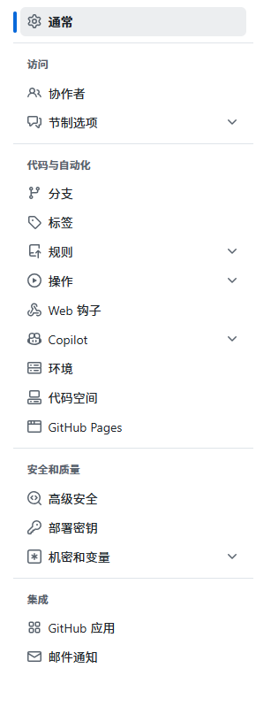

# 这是一个使用github搭建的网站
## 以下是搭建教程：
[建议使用汉化脚本汉化github以获得最佳体验](https://github.com/maboloshi/github-chinese)
#### 点击设置

#### 点击github pages

#### 设置仓库名称为【你的github名称】.github.io

#### 新建index.html文件，输入html代码以创建网站页面
#### 完结
